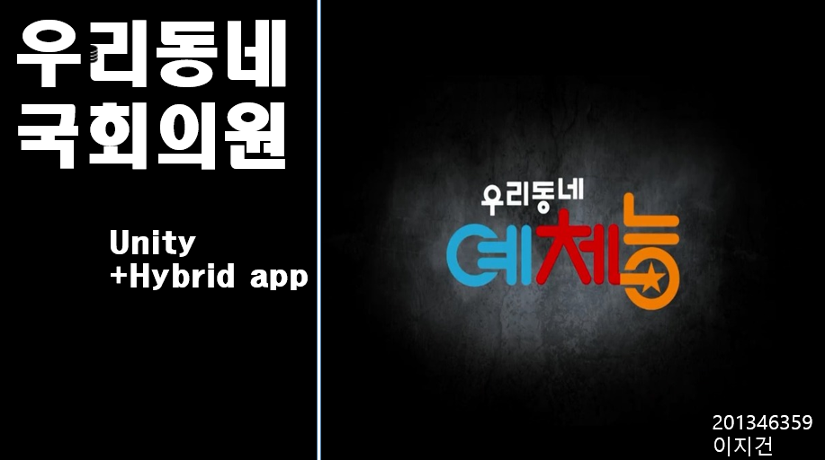
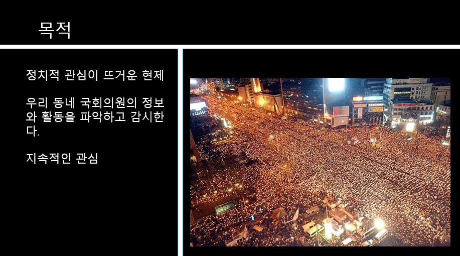
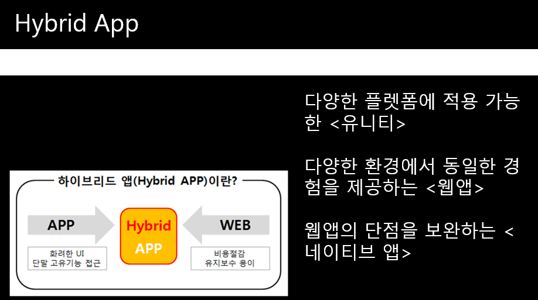
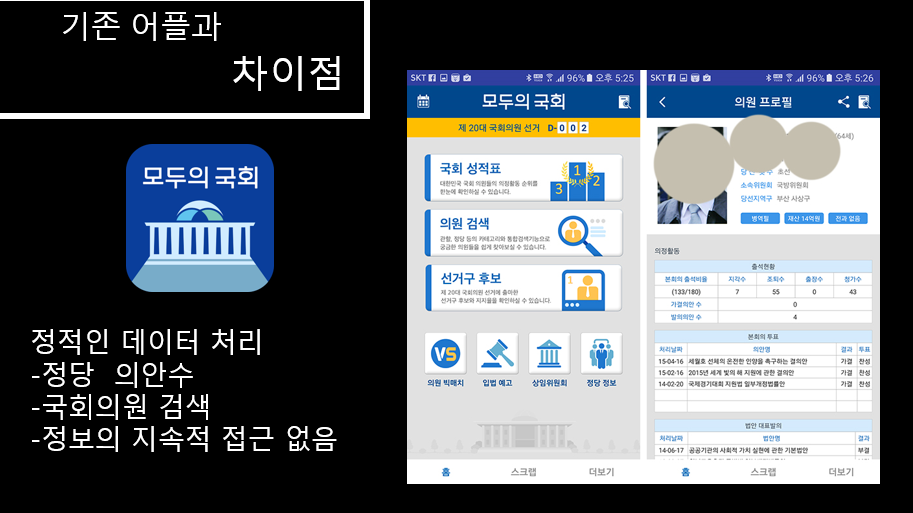
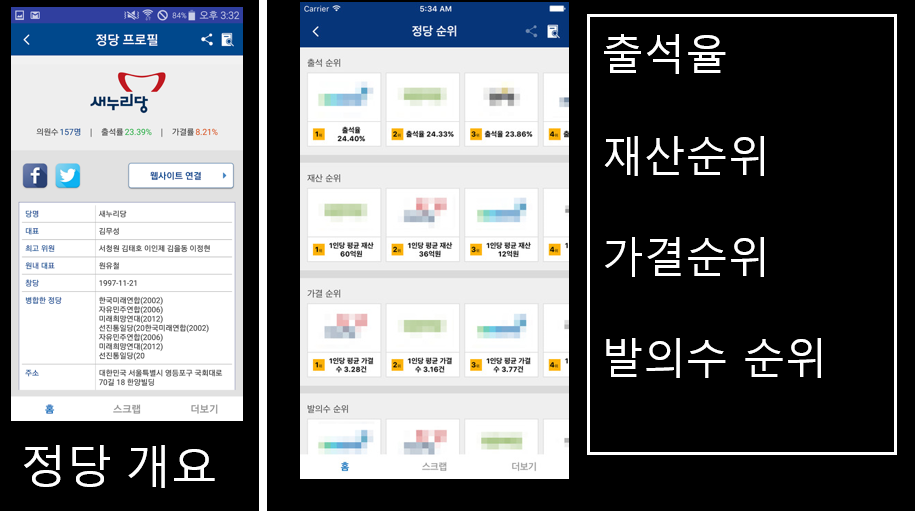
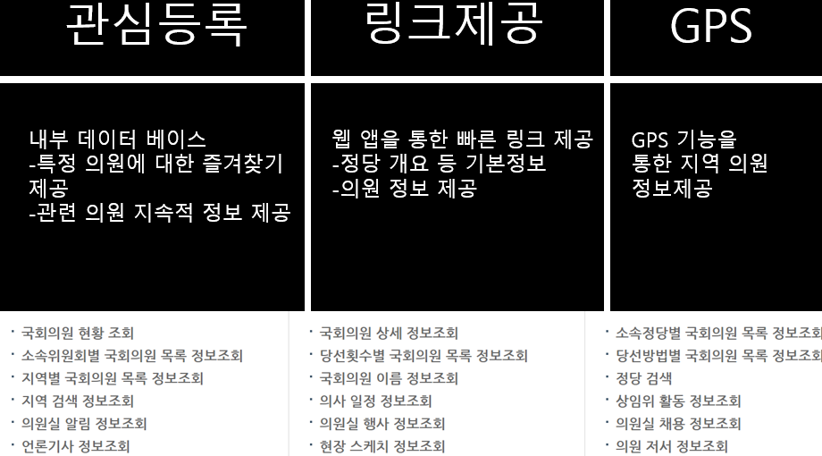
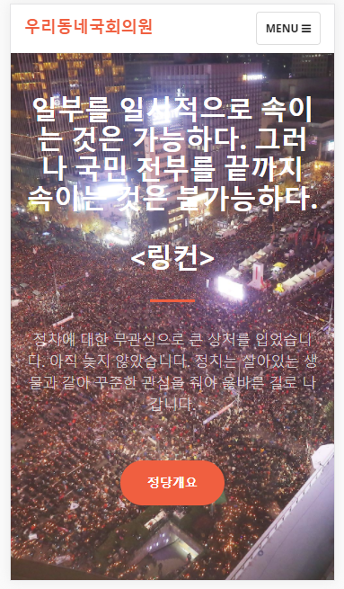
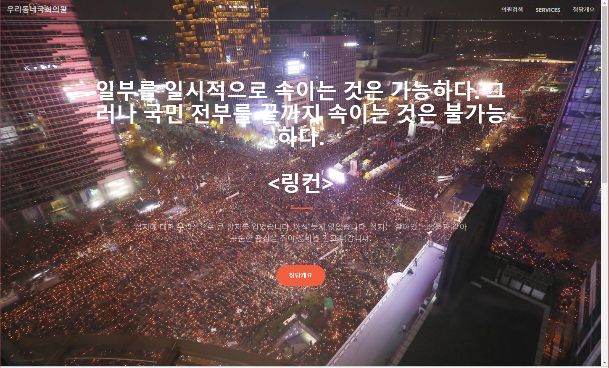
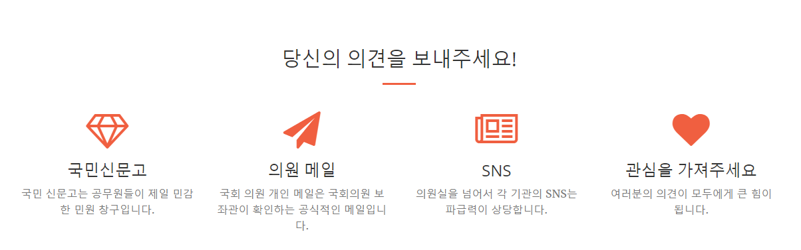
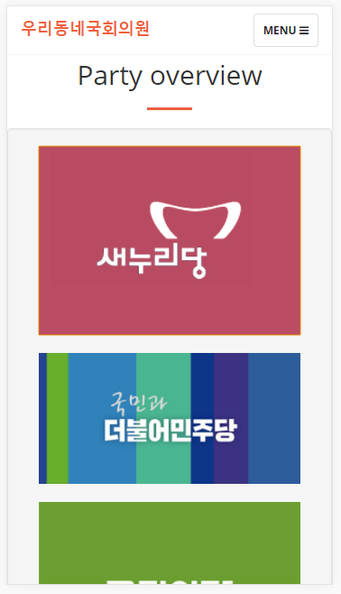

# 우리동네 국회의원
## 1. 소개

 

## 2. Angular2와 Bootsrap를 통한 웹 페이지
* Firebase hosting을 이용해 호스팅
* angular2를 통해서 single page application을 구현
* UI는 Twitter의 Bootsrap을 이용해 구성
  

 _ 갤럭시 폰으로 봤을 때의 화면 _
  

 _ 웹으로 접속했을 때의 화면 _
  

  

  

